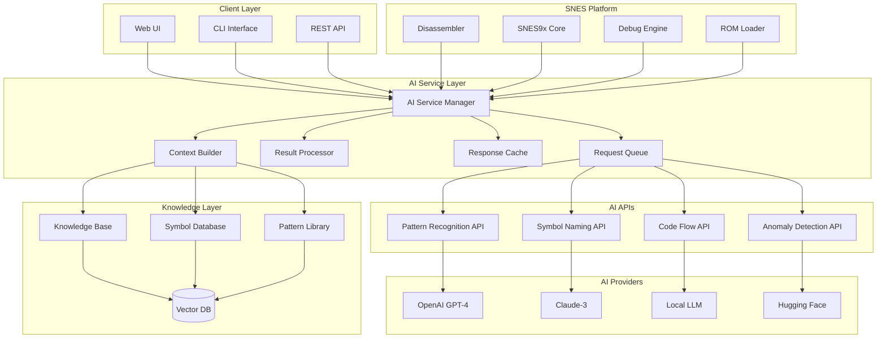
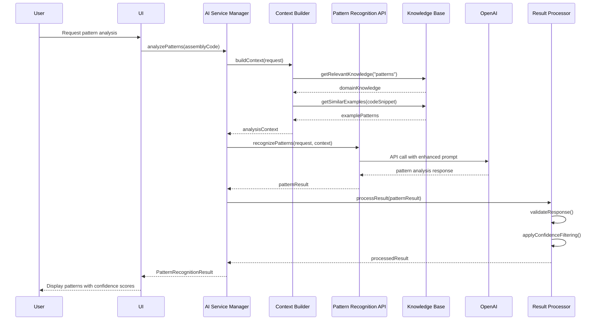
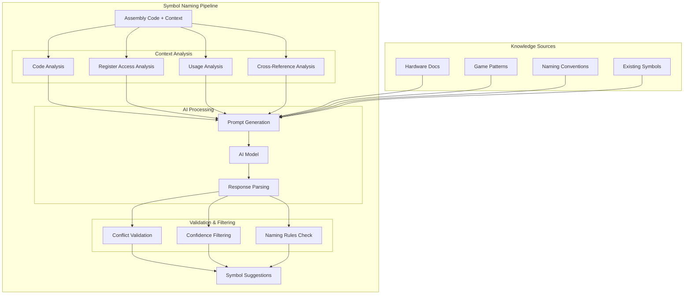
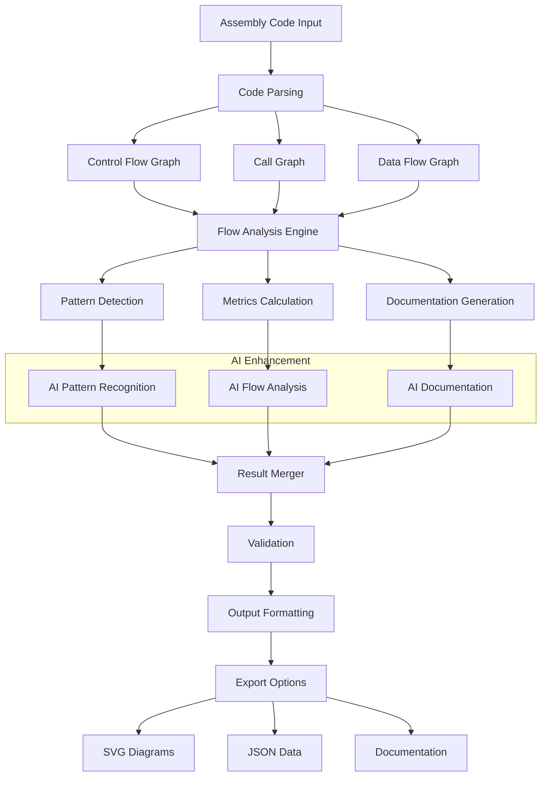
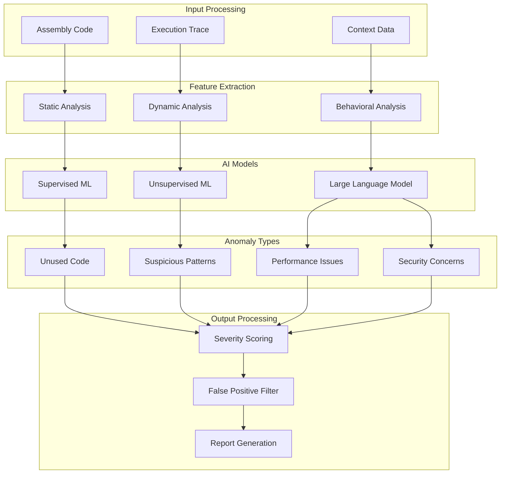
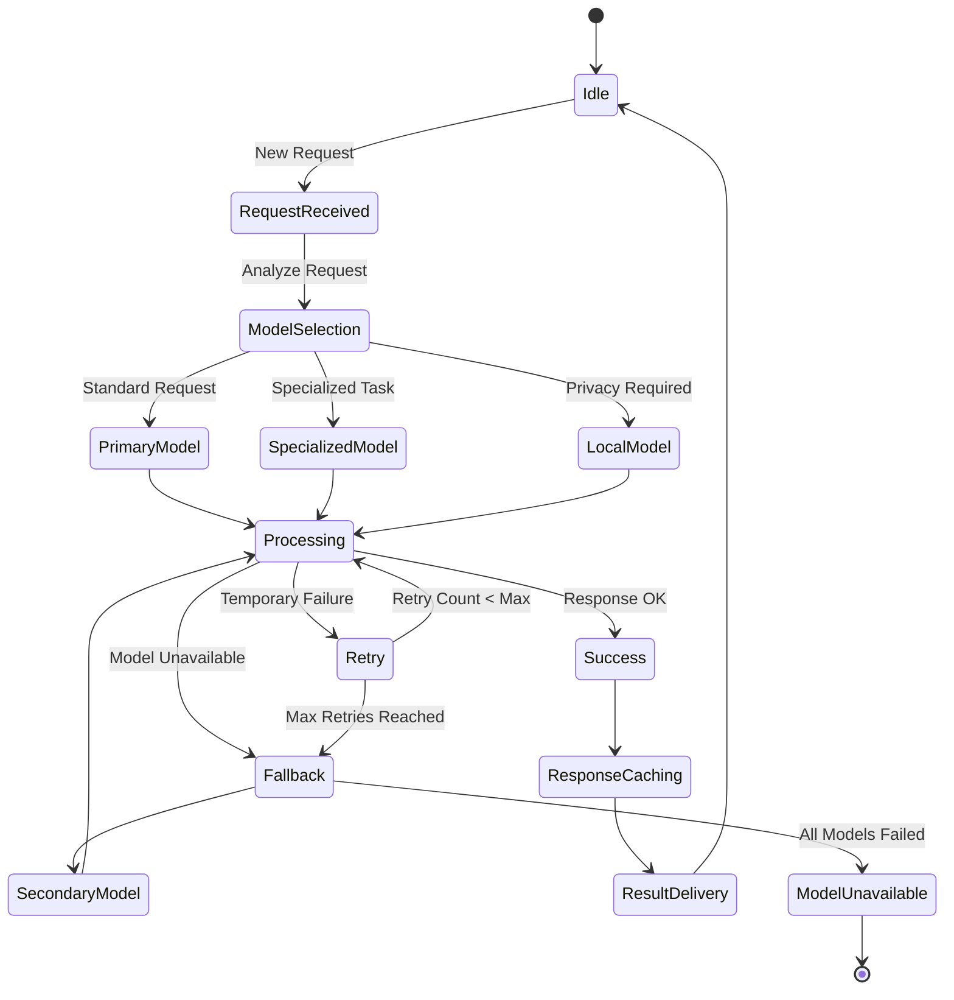
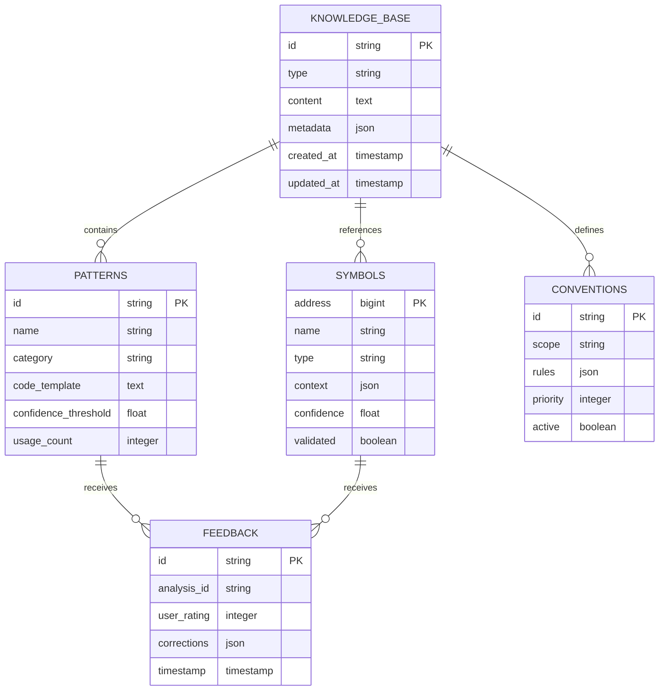

# GenAI Architecture Diagrams

## System Overview Architecture



## Pattern Recognition Flow



## Symbol Naming Architecture



## Code Flow Analysis Data Flow



## Anomaly Detection Architecture



## AI Provider Management



## Caching and Performance Architecture

```mermaid
graph TB
    subgraph "Request Processing"
        Request[Incoming Request]
        Hash[Request Hash]
        L1[L1 Cache Check]
    end
    
    subgraph "Cache Hierarchy"
        Memory[In-Memory Cache]
        Redis[Redis Cache]
        Disk[Disk Cache]
    end
    
    subgraph "AI Processing"
        Queue[Processing Queue]
        Batch[Batch Processor]
        Model[AI Model]
    end
    
    subgraph "Result Processing"
        Validate[Result Validation]
        Store[Cache Storage]
        Deliver[Result Delivery]
    end
    
    Request --> Hash
    Hash --> L1
    
    L1 --> Memory : Cache Hit
    Memory --> Deliver : Found
    
    L1 --> Redis : L1 Miss
    Redis --> Deliver : Found
    
    Redis --> Disk : Redis Miss
    Disk --> Deliver : Found
    
    Disk --> Queue : Cache Miss
    Queue --> Batch
    Batch --> Model
    
    Model --> Validate
    Validate --> Store
    Store --> Memory
    Store --> Redis
    Store --> Disk
    
    Store --> Deliver
```

## Security and Privacy Flow

```mermaid
flowchart TD
    Input[User Input] --> Sanitize[Input Sanitization]
    Sanitize --> Privacy[Privacy Check]
    
    Privacy --> Local[Local Processing] : Sensitive Data
    Privacy --> Cloud[Cloud Processing] : Non-Sensitive
    
    Local --> LocalModel[Local AI Model]
    Cloud --> Encrypt[Data Encryption]
    
    Encrypt --> CloudModel[Cloud AI Model]
    
    LocalModel --> LocalValidation[Local Validation]
    CloudModel --> CloudValidation[Cloud Validation]
    
    LocalValidation --> Audit[Audit Logging]
    CloudValidation --> Audit
    
    Audit --> Output[Secure Output]
    
    subgraph "Security Controls"
        RateLimit[Rate Limiting]
        AuthZ[Authorization]
        Monitor[Monitoring]
    end
    
    Input --> RateLimit
    Input --> AuthZ
    Output --> Monitor
```

## Knowledge Base Architecture



## Integration Points Diagram  

```mermaid
graph LR
    subgraph "SNES Platform Components"
        ROM[ROM Loader]
        DISASM[Disassembler]
        EMU[Emulator Core]
        DEBUG[Debugger]
        DOC[Doc Generator]
    end
    
    subgraph "AI Integration Layer"
        HOOKS[Integration Hooks]
        EVENTS[Event System]
        BRIDGE[Data Bridge]
    end
    
    subgraph "AI Services"
        PATTERN[Pattern Recognition]
        NAMING[Symbol Naming]
        FLOW[Flow Analysis]
        ANOMALY[Anomaly Detection]
    end
    
    ROM --> HOOKS : ROM Loaded
    DISASM --> HOOKS : Code Disassembled
    EMU --> EVENTS : Execution Events
    DEBUG --> EVENTS : Debug Events
    
    HOOKS --> BRIDGE
    EVENTS --> BRIDGE
    
    BRIDGE --> PATTERN : Assembly Code
    BRIDGE --> NAMING : Symbol Requests
    BRIDGE --> FLOW : Execution Traces
    BRIDGE --> ANOMALY : Code Analysis
    
    PATTERN --> DISASM : Pattern Results
    NAMING --> DISASM : Symbol Names
    FLOW --> DOC : Flow Diagrams
    ANOMALY --> DEBUG : Anomaly Reports
```

## Deployment Architecture

```mermaid
graph TB
    subgraph "User Environment"
        Desktop[Desktop App]
        Web[Web Interface]
        CLI[Command Line]
    end
    
    subgraph "Edge/Local Deployment"
        LocalAI[Local AI Models]
        LocalCache[Local Cache]
        LocalDB[Local Database]
    end
    
    subgraph "Cloud Services"
        LB[Load Balancer]
        API[API Gateway]
        
        subgraph "AI Service Cluster"
            ASM1[AI Service Manager 1]
            ASM2[AI Service Manager 2]
            ASM3[AI Service Manager 3]
        end
        
        subgraph "Data Layer"
            Redis[Redis Cluster]
            Vector[Vector Database]
            RDBMS[PostgreSQL]
        end
        
        subgraph "External AI"
            OpenAI[OpenAI API]
            Anthropic[Anthropic API]
            HF[Hugging Face]
        end
    end
    
    Desktop --> LocalAI
    Web --> LB
    CLI --> LocalAI
    
    LocalAI --> LocalCache
    LocalAI --> LocalDB
    
    LB --> API
    API --> ASM1
    API --> ASM2
    API --> ASM3
    
    ASM1 --> Redis
    ASM2 --> Vector
    ASM3 --> RDBMS
    
    ASM1 --> OpenAI
    ASM2 --> Anthropic
    ASM3 --> HF
    
    LocalAI -.-> API : Fallback
```

This comprehensive set of architecture diagrams illustrates the complete GenAI integration system from multiple perspectives, showing how all components interact to provide intelligent reverse engineering capabilities for the SNES platform.
