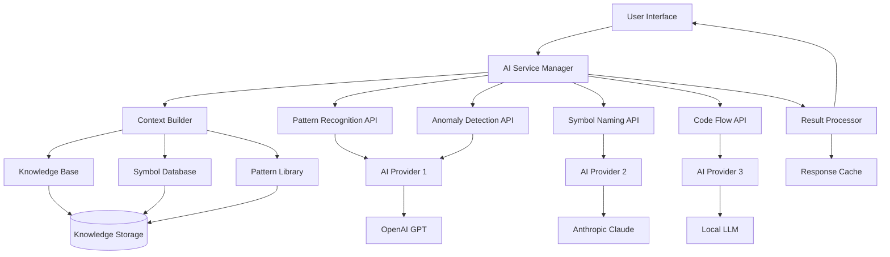

# GenAI Integration Architecture for SNES Reverse Engineering Platform

## Overview

This document outlines the architecture for integrating Generative AI capabilities into our SNES reverse engineering and emulation platform. The system is designed to enhance productivity through intelligent pattern recognition, symbol naming, code analysis, and anomaly detection.

## Use Cases for AI Integration

### 1. Automatic Pattern Recognition in Assembly Code

**Description**: Automatically identify common programming patterns, algorithms, and data structures in disassembled 65816 assembly code.

**Key Features**:
- Function prologue/epilogue detection
- Loop structure identification (for/while/do-while patterns)
- Memory access pattern analysis
- Hardware register usage patterns
- Graphics processing routines identification
- Audio processing pattern recognition
- Game-specific patterns (sprite handling, collision detection, etc.)

**Input**: Raw assembly code or binary data
**Output**: Structured pattern metadata with confidence scores

### 2. Intelligent Symbol Naming Suggestions

**Description**: Generate meaningful names for functions, variables, and memory locations based on code analysis and context.

**Key Features**:
- Context-aware naming based on code functionality
- Hardware register access pattern analysis for naming
- Cross-reference analysis for consistent naming
- Game-specific terminology recognition
- Naming convention adherence (camelCase, snake_case, etc.)
- Conflict detection and resolution

**Input**: Assembly code with addresses and context
**Output**: Suggested symbol names with rationale

### 3. Code Flow Analysis and Documentation Generation

**Description**: Analyze code execution paths and generate comprehensive documentation.

**Key Features**:
- Control flow graph generation
- Call graph analysis
- Data flow tracking
- Function documentation generation
- API documentation creation
- Code comment generation
- Cross-reference documentation

**Input**: Assembly/C code and execution traces
**Output**: Structured documentation and flow diagrams

### 4. Anomaly Detection in Disassembled Code

**Description**: Identify unusual patterns, potential bugs, or interesting code sections in disassembled ROMs.

**Key Features**:
- Unused code detection
- Dead code identification
- Suspicious memory access patterns
- Performance bottleneck detection
- Security vulnerability scanning
- Anti-debugging technique detection
- Compression/encryption detection

**Input**: Disassembled code and execution data
**Output**: Anomaly reports with severity levels

## API Interface Design

### Core AI Service Interface

```typescript
interface AIServiceConfig {
  modelProvider: 'openai' | 'anthropic' | 'local' | 'huggingface';
  modelName: string;
  apiKey?: string;
  endpoint?: string;
  maxTokens: number;
  temperature: number;
}

interface AIAnalysisRequest {
  operation: 'pattern_recognition' | 'symbol_naming' | 'flow_analysis' | 'anomaly_detection';
  data: AnalysisData;
  options: AnalysisOptions;
  context?: AnalysisContext;
}

interface AnalysisData {
  assemblyCode?: string;
  binaryData?: Uint8Array;
  sourceCode?: string;
  memoryMap?: MemoryRegion[];
  executionTrace?: ExecutionEvent[];
}

interface AnalysisOptions {
  confidence_threshold: number;
  max_suggestions: number;
  include_rationale: boolean;
  target_architecture: '65816' | 'spc700';
  analysis_depth: 'shallow' | 'medium' | 'deep';
}

interface AnalysisContext {
  gameTitle?: string;
  knownSymbols?: SymbolTable;
  memoryLayout?: MemoryLayout;
  previousAnalysis?: AnalysisResult[];
}
```

### Pattern Recognition API

```typescript
interface PatternRecognitionAPI {
  recognizePatterns(request: PatternRecognitionRequest): Promise<PatternRecognitionResult>;
  trainCustomPattern(pattern: CustomPattern): Promise<void>;
  getPatternDatabase(): Promise<PatternDatabase>;
}

interface PatternRecognitionRequest extends AIAnalysisRequest {
  operation: 'pattern_recognition';
  patternTypes: PatternType[];
}

interface PatternType {
  category: 'algorithm' | 'data_structure' | 'hardware_access' | 'game_logic';
  subcategory?: string;
  priority: number;
}

interface PatternRecognitionResult {
  patterns: DetectedPattern[];
  confidence: number;
  processingTime: number;
}

interface DetectedPattern {
  type: PatternType;
  location: CodeLocation;
  confidence: number;
  description: string;
  suggestedRefactoring?: string;
  relatedPatterns?: DetectedPattern[];
}
```

### Symbol Naming API

```typescript
interface SymbolNamingAPI {
  suggestNames(request: SymbolNamingRequest): Promise<SymbolNamingResult>;
  validateNaming(symbols: SymbolSuggestion[]): Promise<ValidationResult>;
  updateNamingRules(rules: NamingRule[]): Promise<void>;
}

interface SymbolNamingRequest extends AIAnalysisRequest {
  operation: 'symbol_naming';
  symbols: UnnamedSymbol[];
  namingConvention: NamingConvention;
}

interface UnnamedSymbol {
  address: number;
  type: 'function' | 'variable' | 'constant' | 'label';
  size?: number;
  usageContext: UsageContext[];
}

interface SymbolNamingResult {
  suggestions: SymbolSuggestion[];
  conflicts: NamingConflict[];
}

interface SymbolSuggestion {
  symbol: UnnamedSymbol;
  suggestedName: string;
  confidence: number;
  rationale: string;
  alternatives: string[];
}
```

### Code Flow Analysis API

```typescript
interface CodeFlowAPI {
  analyzeFlow(request: FlowAnalysisRequest): Promise<FlowAnalysisResult>;
  generateDocumentation(flowData: FlowAnalysisResult): Promise<DocumentationResult>;
  exportFlowDiagram(flowData: FlowAnalysisResult, format: 'svg' | 'png' | 'graphviz'): Promise<Buffer>;
}

interface FlowAnalysisRequest extends AIAnalysisRequest {
  operation: 'flow_analysis';
  analysisType: 'control_flow' | 'data_flow' | 'call_graph' | 'comprehensive';
  entryPoints: number[];
}

interface FlowAnalysisResult {
  controlFlowGraph: ControlFlowGraph;
  callGraph: CallGraph;
  dataFlowGraph: DataFlowGraph;
  metrics: FlowMetrics;
}

interface ControlFlowGraph {
  nodes: CFGNode[];
  edges: CFGEdge[];
  entryNode: string;
  exitNodes: string[];
}
```

### Anomaly Detection API

```typescript
interface AnomalyDetectionAPI {
  detectAnomalies(request: AnomalyDetectionRequest): Promise<AnomalyDetectionResult>;
  trainAnomalyModel(trainingData: AnomalyTrainingData): Promise<void>;
  updateAnomalyRules(rules: AnomalyRule[]): Promise<void>;
}

interface AnomalyDetectionRequest extends AIAnalysisRequest {
  operation: 'anomaly_detection';
  anomalyTypes: AnomalyType[];
  severityThreshold: 'low' | 'medium' | 'high' | 'critical';
}

interface AnomalyDetectionResult {
  anomalies: DetectedAnomaly[];
  summary: AnomalySummary;
  recommendations: string[];
}

interface DetectedAnomaly {
  type: AnomalyType;
  location: CodeLocation;
  severity: 'low' | 'medium' | 'high' | 'critical';
  description: string;
  evidence: Evidence[];
  suggestedAction?: string;
}
```

## Architecture Components

### 1. AI Service Manager

**Responsibilities**:
- Manage multiple AI model providers
- Load balancing and failover
- Request queuing and throttling
- Response caching
- Model switching based on task type

**Implementation**:
```typescript
class AIServiceManager {
  private providers: Map<string, AIProvider>;
  private loadBalancer: LoadBalancer;
  private cache: ResponseCache;
  private queue: RequestQueue;

  async processRequest(request: AIAnalysisRequest): Promise<AnalysisResult>;
  async selectOptimalProvider(request: AIAnalysisRequest): Promise<AIProvider>;
  async cacheResponse(request: AIAnalysisRequest, response: AnalysisResult): Promise<void>;
}
```

### 2. Context Builder

**Responsibilities**:
- Gather relevant context for AI analysis
- Build prompts with appropriate background information
- Manage context window limitations
- Include relevant documentation and examples

**Implementation**:
```typescript
class ContextBuilder {
  private knowledgeBase: KnowledgeBase;
  private symbolDatabase: SymbolDatabase;
  private patternLibrary: PatternLibrary;

  buildContext(request: AIAnalysisRequest): AnalysisContext;
  includeRelevantDocumentation(topic: string): DocumentationChunk[];
  addSimilarExamples(codeSnippet: string): CodeExample[];
}
```

### 3. Result Processor

**Responsibilities**:
- Parse and validate AI responses
- Apply confidence filtering
- Merge results from multiple analyses
- Format output for different consumers

**Implementation**:
```typescript
class ResultProcessor {
  validateResponse(response: any, expectedSchema: Schema): ValidationResult;
  applyConfidenceFiltering(results: AnalysisResult[], threshold: number): AnalysisResult[];
  mergeResults(results: AnalysisResult[]): MergedResult;
  formatForUI(result: AnalysisResult): UIFormattedResult;
}
```

### 4. Knowledge Base

**Responsibilities**:
- Store domain-specific knowledge about SNES architecture
- Maintain pattern libraries and naming conventions
- Provide context for AI models
- Learn from user feedback

**Implementation**:
```typescript
class KnowledgeBase {
  private snesArchitecture: ArchitectureKnowledge;
  private gamePatterns: GamePatternLibrary;
  private namingConventions: NamingConventionDatabase;

  getRelevantKnowledge(topic: string): KnowledgeChunk[];
  updateFromFeedback(feedback: UserFeedback): void;
  exportKnowledge(): KnowledgeExport;
}
```

## Component Interaction Diagram



## AI Model Requirements and Constraints

### Model Capabilities

#### Required Capabilities:
1. **Code Understanding**: Ability to parse and understand assembly language and C code
2. **Pattern Recognition**: Identify recurring patterns in code structures
3. **Context Awareness**: Maintain context across multiple code segments
4. **Domain Knowledge**: Understanding of computer architecture and game development
5. **Reasoning**: Logical reasoning about code functionality and purpose

#### Preferred Capabilities:
1. **Multi-modal**: Process both text and binary data
2. **Fine-tuning**: Ability to customize for domain-specific tasks
3. **Incremental Learning**: Learn from user feedback and corrections
4. **Explanation**: Provide reasoning for suggestions and decisions

### Model Constraints

#### Performance Constraints:
- **Latency**: Maximum 5 seconds for pattern recognition
- **Throughput**: Handle at least 100 requests per minute
- **Memory**: Operate within 8GB RAM limits for local models
- **Context Window**: Minimum 32k tokens for complex analyses

#### Quality Constraints:
- **Accuracy**: Minimum 85% accuracy for pattern recognition
- **Precision**: Maximum 10% false positive rate for anomaly detection
- **Completeness**: Identify at least 90% of common patterns
- **Consistency**: Same input should produce consistent results

#### Operational Constraints:
- **Cost**: Maximum $0.10 per analysis for cloud models
- **Privacy**: Support for local deployment without cloud dependencies
- **Scalability**: Horizontal scaling to handle increased load
- **Reliability**: 99.9% uptime with graceful degradation

### Model Selection Matrix

| Use Case | Primary Model | Fallback Model | Local Option |
|----------|---------------|----------------|---------------|
| Pattern Recognition | GPT-4 Turbo | Claude-3 Opus | CodeLlama-34B |
| Symbol Naming | Claude-3 Sonnet | GPT-4 | CodeT5+ |
| Flow Analysis | GPT-4 | Claude-3 Haiku | Local Graph Model |
| Anomaly Detection | Claude-3 Opus | GPT-4 Turbo | Custom ML Model |

### Training Data Requirements

#### Code Corpus:
- 10,000+ SNES game ROMs (disassembled)
- 1,000+ documented reverse engineering projects
- Standard library implementations for 65816
- Hardware documentation and programming guides

#### Pattern Examples:
- Common game programming patterns
- Graphics and audio processing routines
- Memory management techniques
- Performance optimization patterns

#### Symbol Naming Examples:
- Well-documented open-source SNES games
- Hardware register naming conventions
- Industry-standard naming patterns
- Game-specific terminology databases

## Integration Points

### 1. Disassembler Integration
```typescript
interface DisassemblerIntegration {
  onDisassemblyComplete(result: DisassemblyResult): void;
  requestPatternAnalysis(code: AssemblyCode): Promise<PatternAnalysisResult>;
  applySuggestedNames(suggestions: SymbolSuggestion[]): void;
}
```

### 2. Debugger Integration
```typescript
interface DebuggerIntegration {
  onBreakpoint(context: DebugContext): void;
  analyzeExecutionPath(trace: ExecutionTrace): Promise<FlowAnalysisResult>;
  detectRuntimeAnomalies(state: SystemState): Promise<AnomalyReport>;
}
```

### 3. Documentation Generator Integration
```typescript
interface DocumentationIntegration {
  generateCodeDocumentation(analysis: FlowAnalysisResult): Promise<Documentation>;
  updateSymbolDocumentation(symbol: Symbol, context: AnalysisContext): Promise<SymbolDoc>;
  createArchitectureDiagram(components: Component[]): Promise<Diagram>;
}
```

## Security and Privacy Considerations

### Data Protection:
- No ROM data sent to cloud services without explicit consent
- Local-first approach for sensitive analysis
- Encrypted communication channels
- Audit logging for all AI requests

### Model Security:
- Input sanitization for all AI requests
- Output validation and filtering
- Rate limiting and abuse prevention
- Model provider rotation for security

### Privacy Controls:
- Opt-in for cloud-based analysis
- Data retention policies
- User data deletion capabilities
- Transparent data usage reporting

## Performance Optimization

### Caching Strategy:
- Response caching for identical requests
- Pattern library caching
- Incremental analysis results
- Multi-level cache hierarchy

### Batch Processing:
- Batch similar requests together
- Asynchronous processing pipeline
- Priority queuing system
- Background analysis scheduling

### Resource Management:
- Dynamic model loading/unloading
- Memory pool management
- CPU/GPU utilization optimization
- Network bandwidth optimization

## Monitoring and Metrics

### Performance Metrics:
- Request latency and throughput
- Model accuracy and precision
- Resource utilization
- Error rates and types

### Quality Metrics:
- User satisfaction scores
- Suggestion acceptance rates
- False positive/negative rates
- Coverage and completeness

### Business Metrics:
- Cost per analysis
- User engagement
- Feature adoption rates
- ROI measurement

## Implementation Phases

### Phase 1: Foundation (Months 1-2)
- Core AI service manager
- Basic pattern recognition
- Simple symbol naming
- Local model support

### Phase 2: Enhancement (Months 3-4)
- Advanced flow analysis
- Anomaly detection
- Multiple model provider support
- Caching and optimization

### Phase 3: Integration (Months 5-6)
- Full platform integration
- UI/UX improvements
- Performance optimization
- Documentation and training

### Phase 4: Advanced Features (Months 7-8)
- Custom pattern training
- Incremental learning
- Advanced visualizations
- Enterprise features

This architecture provides a robust foundation for integrating AI capabilities into the SNES reverse engineering platform while maintaining flexibility, performance, and security requirements.
